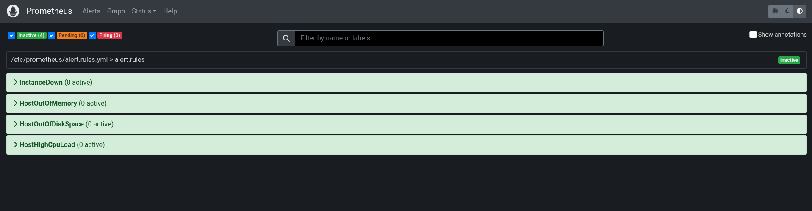

### How to use these rules?

1. Go to `/etc/prometheus/`
2. Create `alert.rule.yml` file with the content of [alert ruele file]("./alert.rule.yml") && save and exit
3. Edit `prometheus.yml` file

uncomment

```
alerting:
  alertmanagers:
    - static_configs:
        - targets:
          - localhost:9093
```

and show rule file

```
# Load rules once and periodically evaluate them according to the global 'evaluation_interval'.
rule_files:
    - "alert.rules.yml"
```

4. Restart `prometheus` service.
5. Go to `<server-ip>:9090/alerts` you should see something like this




> If so, congrats. You have done it
