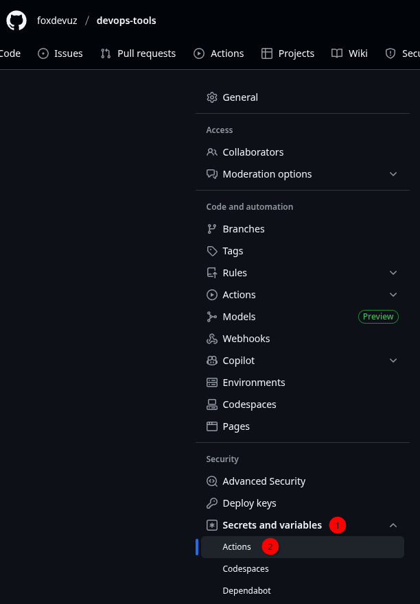

## This is a tutorial for how to setup the repo secret that will be used in deployment.

### 1. Go to repository 

### 2. Go to settings

### 3. Go to `Secrets and variables` then `Actions`

### 4. Click `New repository secret`
### 5. Add your secret

> For `Name` write secret name. Eg: `GIT_TOKEN`

> For `Secret` put the value of the secret